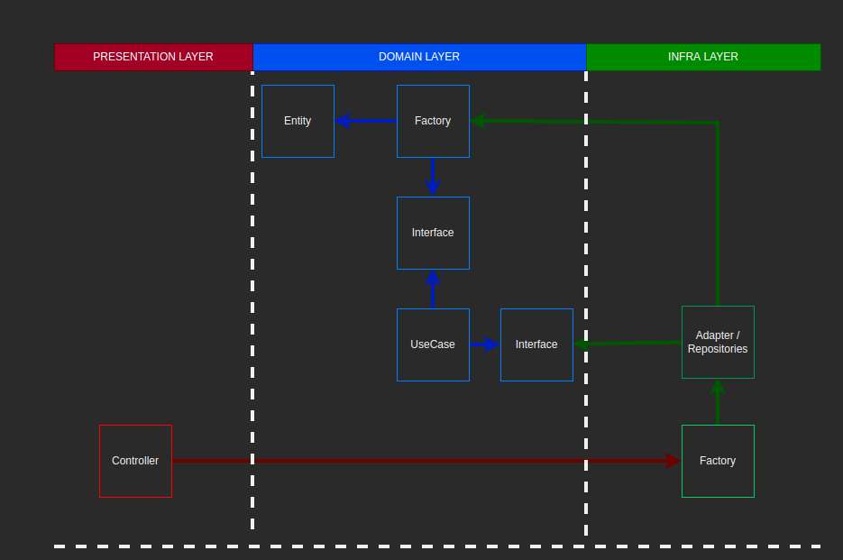

## Description

APIs para gestão de funcionários

## Funcionalidades

- Controle de funcionários
- Controle de exames médicos e documentos
- Download de holerites

## Tecnologias utilizadas

- Javascript
- Typescript
- Nodejs
- TypeOrm
- AWS
- Postgres

## Padrões e praticas de desenvolvimento

- SOLID
- Clean Architecture
- DDD
- TDD

## Desenho de arquitetura

  

